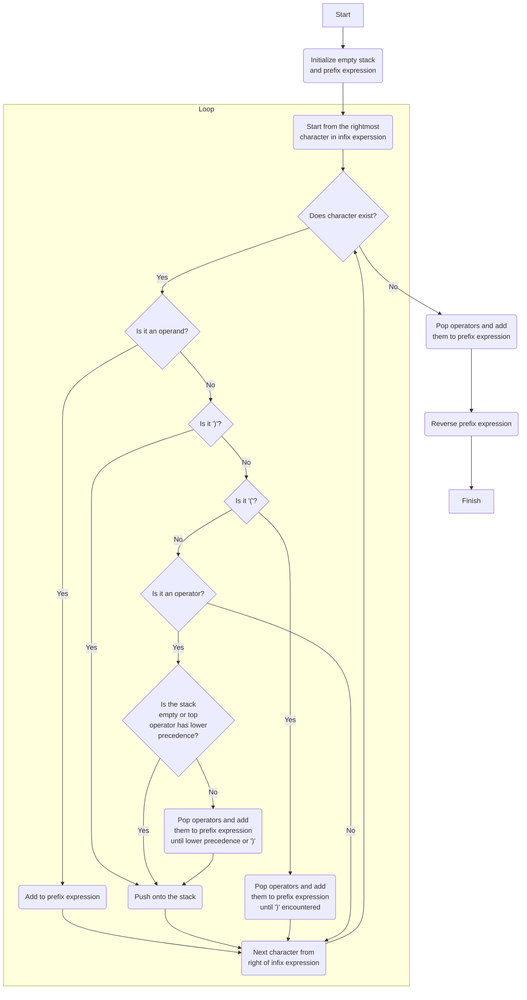
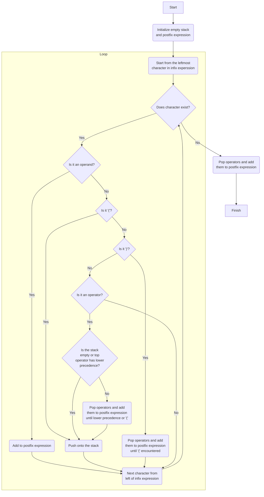
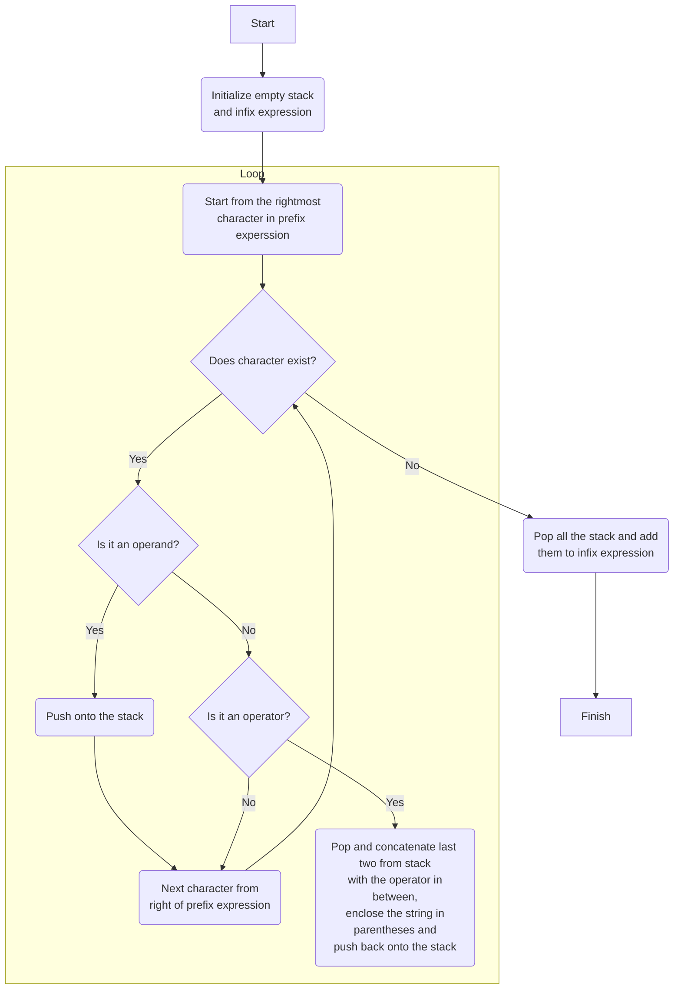
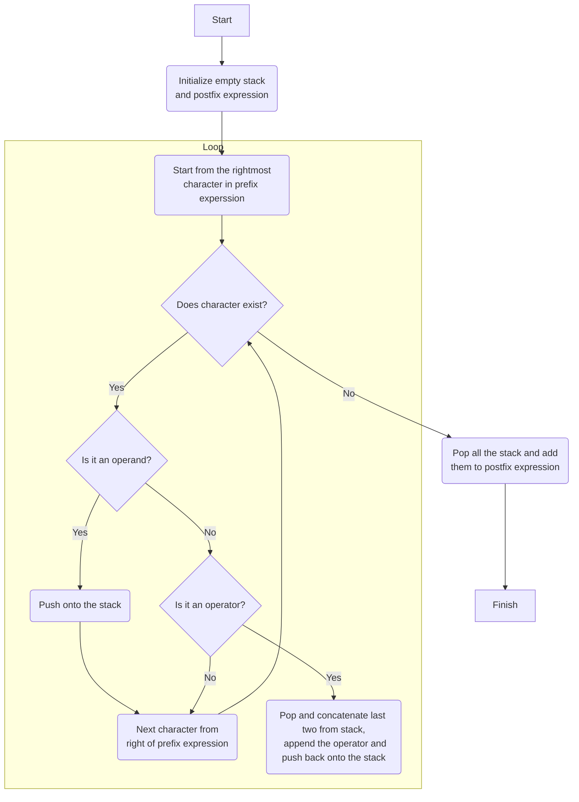
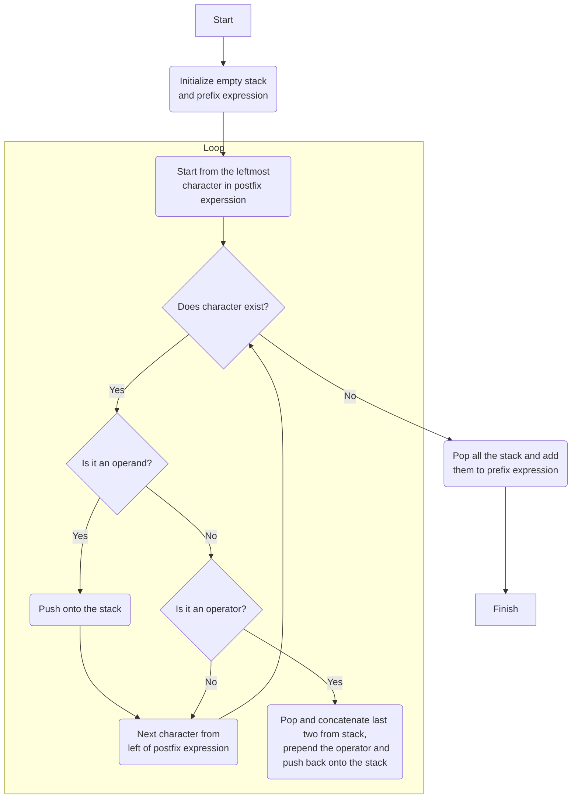

# cpp-expression-conversions

## _Convert Expressions Effortlessly in C++_

This repository contains C++ code implementations of common expression conversion algorithms. Convert infix expressions to prefix and postfix notations, convert prefix expressions to infix and postfix notations, and convert postfix expressions to infix and prefix notations using C++.

## Overview

This GitHub repository is a collection of C++ programs demonstrating various expression conversion algorithms. Expression conversion is a fundamental concept in computer science and plays a crucial role in parsing, evaluating, and manipulating mathematical expressions. The repository covers the following conversions:

1. **Infix to Prefix Conversion**: Converts infix expressions (e.g., `A + B * C`) to prefix notation (e.g., `+ A * B C`).

2. **Prefix to Infix Conversion**: Converts prefix expressions (e.g., `+ * A B C`) to infix notation (e.g., `(A + (B * C))`).

3. **Infix to Postfix Conversion**: Converts infix expressions (e.g., `A + B * C`) to postfix notation (e.g., `A B C * +`).

4. **Postfix to Infix Conversion**: Converts postfix expressions (e.g., `A B C * +`) to infix notation (e.g., `(A + (B * C))`).

5. **Prefix to Postfix Conversion**: Converts prefix expressions (e.g., `+ * A B C`) to postfix notation (e.g., `A B C * +`).

6. **Postfix to Prefix Conversion**: Converts postfix expressions (e.g., `A B C * +`) to prefix notation (e.g., `+ A * B C`).

## Usage

To compile and run the conversion algorithms in this repository, follow these steps:

1. **Install Visual Studio Code (VS Code)**:
   If you don't already have VS Code installed, you can download it from [here](https://code.visualstudio.com/).

2. **Install the C/C++ Compile Run extension**:
   - Download and install the C/C++ Compile Run extension from the [Visual Studio Code Marketplace](https://marketplace.visualstudio.com/items?itemName=danielpinto8zz6.c-cpp-compile-run).

3. **Clone the Repository**:
   - Clone this repository to your local machine using the following command:
     ```
     git clone https://github.com/bornalgo/cpp-expression-conversions.git
     ```

4. **Open VS Code at the Repository Directory**:
   - Navigate to the cloned repository's directory using your terminal or file explorer.
   - Open Visual Studio Code by typing `code .` in your terminal (make sure you are at the root of the repository) or by opening the directory in VS Code using the `File` -> `Open Folder` option.

5. **Compile and Run**:
   - Inside the `src` folder, you'll find multiple C++ files for different conversion algorithms (e.g., infix2prefix.cpp, prefix2infix.cpp, etc.).
   - Open the C++ file for the conversion algorithm you want to run.
   - Press `F5` or use the "Run" option to compile and run the code.
   
   Example:
   - If you want to run the infix to prefix conversion, open `infix2prefix.cpp`, press `F5`, and the extension will compile and execute the code.
   
   Repeat step 5 for other conversion algorithms as needed.

By following these steps, you can easily compile and run the conversion algorithms using Visual Studio Code and the C/C++ Compile Run extension.


## Description

###
<details>
  <summary><strong>Infix expressions</strong></summary>
Infix expressions are a common way to write mathematical and arithmetic expressions that we encounter in everyday mathematics and programming. In an infix expression, operators are placed between operands, and parentheses are used to indicate the order of operations. Here are some key characteristics of infix expressions:

1. **Operators Between Operands**: In infix expressions, binary operators (e.g., +, -, *, /) are placed between two operands. For example, in the expression `3 + 4`, the operator "+" is placed between the operands "3" and "4."

2. **Order of Operations**: Infix expressions adhere to the usual order of operations rules. This means that operators like multiplication and division are evaluated before addition and subtraction, and parentheses can be used to override the default order. For example, in the expression `3 + 4 * 2`, the multiplication (`*`) is performed before the addition (`+`), resulting in `11`.

3. **Parentheses for Grouping**: Parentheses are used to group sub-expressions and explicitly specify the order of operations. For example, in the expression `(3 + 4) * 2`, the addition inside the parentheses is performed first, resulting in `7 * 2`, which equals `14`.

4. **Infix Notation in Mathematics**: Infix notation is commonly used in mathematics and everyday calculations. It is the standard way we write expressions on paper and in textbooks. For instance, you might write "2 + 3" to represent the addition of two numbers.

5. **Infix Notation in Programming**: In many programming languages, infix notation is used for arithmetic expressions. For example, in C++, you would write `x + y` to represent the addition of two variables `x` and `y`.

6. **Complex Expressions**: Infix expressions can become quite complex when multiple operators and parentheses are involved. For example, `(5 + 3) * (7 - 2)` is a complex infix expression that involves addition, subtraction, and multiplication.

7. **Conversion**: In computer science and programming, infix expressions are often converted to other notations like postfix (reverse Polish notation) or prefix (Polish notation) for easier evaluation by computers.

While infix notation is convenient for humans to read and write, it can be challenging for computers to evaluate directly. Therefore, conversion to other notations, such as postfix or prefix, is sometimes preferred for computer-based calculations and parsing algorithms.
<details>
  <summary>Illustrate infix to prefix convesion</summary>

<!DOCTYPE html>
<html lang="en">
<head>
    <meta charset="UTF-8" />
    <meta name="viewport" content="width=device-width, initial-scale=1.0" />
    <title>Page Title</title>
    <style>
        .boxed {
        border: 3px solid #535353;
        margin: 0px auto;
        width: auto; /* Make width auto */
        padding: 10px;
        border-radius: 10px;
        }
    </style>
</head>
<body>
<div class="boxed">

**Infix to Prefix Conversion Steps:**

- Initialize an empty stack to hold operators and parentheses.
- Initialize an empty string to store the prefix expression.
- Starting from the rightmost character in the infix expression, process each character from right to left:
   - If it's an operand (a variable or number), add it to the prefix expression.
   - If it's a closing parenthesis ')', push it onto the stack.
   - If it's an opening parenthesis '(', pop operators from the stack and add them to the prefix expression until a closing parenthesis ')' is encountered. Pop and discard the closing parenthesis.
   - If it's an operator (+, -, *, /, etc.), compare its precedence with the operator at the top of the stack. 
      - If the stack is empty or the top operator has lower precedence, push the current operator onto the stack. 
      - Otherwise, pop operators from the stack and add them to the prefix expression until an operator with lower precedence or an opening parenthesis is encountered, then push the current operator onto the stack.
- After processing all characters in the reversed infix expression, pop any remaining operators from the stack and add them to the prefix expression.
- Reverse the prefix expression. The reversed prefix expression is the correct prefix expression.

</div>
</body>
</html>



Let's illustrate the process of converting an infix expression to a prefix expression with an example. 

**Example Infix Expression**: `A + B * (C - D)`

- Initialize an empty stack to hold operators: `Stack: empty`
- Initialize an empty string to store the prefix expression: `Prefix: ""`
- Starting from the rightmost character, we process each character in the infix expression from right to left:
   1. `)`: Closing parenthesis. Push it onto the stack: `Stack: )`, `Prefix: ""`
   2. `D`: Operand, add it to the prefix expression: `Stack: )`, `Prefix: "D"`
   3. `-`: Operator, push it onto the stack: `Stack: -)`, `Prefix: "D"`
   4. `C`: Operand, add it to the prefix expression: `Prefix: "CD"`
   5. `(`: Openning parenthesis. Pop operators from the stack and add them to the prefix expression until a closing parenthesis is encountered: `Stack: empty`,    `Prefix: "CD-"`.
   6. `*`: Operator, push it onto the stack: `Stack: *`, `Prefix: "CD-"`.
   7. `B`: Operand, add it to the prefix expression: `Prefix: "CD-B"`.
   8. `+`: Operator, push it onto the stack while poping higher precedence operators: `Stack: +`, `Prefix: "CD-B*"`.
   9. `A`: Operand, add it to the prefix expression: `Prefix: "CD-B*A"`.
   10. End of expression. 
- Pop any remaining operators from the stack and add them to the prefix expression: `Stack: *`, `Prefix: "CD-B*A+"`.
- Reverse the prefix expression: `+A*B-CD`.
- The resulting prefix expression is indeed `+A*B-CD`, which is correct for the infix expression `A + B * (C - D)`.

</details>
<details>
  <summary>Illustrate infix to postfix convesion</summary>

<!DOCTYPE html>
<html lang="en">
<head>
    <meta charset="UTF-8" />
    <meta name="viewport" content="width=device-width, initial-scale=1.0" />
    <title>Page Title</title>
    <style>
        .boxed {
        border: 3px solid #535353;
        margin: 0px auto;
        width: auto; /* Make width auto */
        padding: 10px;
        border-radius: 10px;
        }
    </style>
</head>
<body>
<div class="boxed">

**Infix to Postfix Conversion Steps:**

- Initialize an empty stack to hold operators and parentheses.
- Initialize an empty string to store the postfix expression.
- Starting from the leftmost character in the infix expression, process each character from left to right:
   - If it's an operand (a variable or number), add it to the postfix expression.
   - If it's an opening parenthesis '(', push it onto the stack.
   - If it's a closing parenthesis ')', pop operators from the stack and add them to the postfix expression until an opening parenthesis '(' is encountered. Pop and discard the opening parenthesis.
   - If it's an operator (+, -, *, /, etc.), compare its precedence with the operator at the top of the stack (if any):
      - If the stack is empty or the top operator has lower precedence, push the current operator onto the stack.
      - Otherwise, pop operators from the stack and add them to the postfix expression until an operator with lower precedence or an opening parenthesis is encountered. Then, push the current operator onto the stack.
- After processing all characters in the infix expression, pop any remaining operators from the stack and add them to the postfix expression.
- The postfix expression obtained is the result of the conversion.

</div>
</body>
</html>



Let's illustrate the process of converting an infix expression to a postfix expression with an example. 

**Example Infix Expression**: `A + B * (C - D)`

**Step 1**: Convert to Postfix Using a Stack

- Initialize an empty stack to hold operators: `Stack: empty`
- Initialize an empty string to store the postfix expression: `Postfix: ""`
- Starting from the leftmost character, we process each character in the infix expression:
   1. `A`: Operand, add it to the postfix expression: `Stack: empty`, `Postfix: "A"`
   2. `+`: Operator, push it onto the stack: `Stack: +`, `Postfix: "A"`
   3. `B`: Operand, add it to the postfix expression: `Stack: +`, `Postfix: "AB"`
   4. `*`: Operator, it has higher precedence than `+`, so push it onto the stack: `Stack: *+`, `Postfix: "AB"`
   5. `(`: Opening parenthesis, push it onto the stack: `Stack: (*+`, `Postfix: "AB"`
   6. `C`: Operand, add it to the postfix expression: `Stack: (*+`, `Postfix: "ABCD"`
   7. `-`: Operator, push it onto the stack: `Stack: -(*+`, `Postfix: "ABCD"`
   8. `D`: Operand, add it to the postfix expression: `Stack: -(*+`, `Postfix: "ABCD"`
   9. `)`: Closing parenthesis, pop operators from the stack and add them to the postfix expression until an opening parenthesis is encountered: `Stack: *+`, `Postfix: "ABCD-"`
- Pop any remaining operators from the stack and add them to the postfix expression: `Stack: empty`, `Postfix: "ABCD-*+"`.
- The resulting postfix expression is indeed `ABCD-*+`, which is correct for the infix expression `A + B * (C - D)`.

</details>
</details>

###
<details>
  <summary><strong>Prefix expressions</strong></summary>
Prefix expressions, also known as Polish notation, are a mathematical notation in which each operator precedes its operands. In contrast to infix expressions, where operators are placed between operands, prefix expressions place operators before their corresponding operands. Here are some key characteristics of prefix expressions:

1. **Operator Prefixing Operands**: In prefix expressions, operators come before the operands they act upon. For example, the infix expression "3 + 4" would be represented in prefix notation as "+ 3 4."

2. **No Need for Parentheses**: One of the significant advantages of prefix notation is that it eliminates the need for parentheses to indicate the order of operations. In infix notation, parentheses are used to clarify which operations should be performed first, especially in complex expressions. In prefix notation, the order of operations is unambiguous because operators always appear before their operands.

3. **Order of Evaluation**: In prefix notation, the order of evaluation is explicit and follows a left-to-right order. The first operator encountered is applied to the two following operands, and this process continues recursively until the entire expression is evaluated. For example, in the expression "+ 3 * 4 5," the multiplication is performed first, resulting in "3 * 20," and then the addition is performed to yield a final result of "23."

4. **Mathematical Functions**: Prefix notation is commonly used in computer science and programming for mathematical functions and expressions. It is often utilized in calculators and programming languages that support functional programming paradigms.

5. **Ease of Parsing**: Parsing and evaluating prefix expressions can be simpler for computers compared to infix expressions. This is because there is no need to handle parentheses and the order of operations is explicit.

6. **Conversion**: In some situations, infix expressions are converted to prefix notation for easier evaluation by computers. This conversion can be done using algorithms like the Shunting Yard or by manually reordering the expressions.

7. **Examples**: Here are some examples of expressions in prefix notation:
   - Addition: "+ 3 4" (equivalent to infix "3 + 4")
   - Subtraction: "- 7 2" (equivalent to infix "7 - 2")
   - Multiplication: "* 5 6" (equivalent to infix "5 * 6")
   - Division: "/ 10 2" (equivalent to infix "10 / 2")

In summary, prefix expressions are a notation where operators are placed before operands, allowing for unambiguous representation of mathematical expressions without the need for parentheses. They are used in certain programming languages and calculator applications and are particularly useful when implementing mathematical functions and parsing algorithms.

<details>
  <summary>Illustrate prefix to infix convesion</summary>
<!DOCTYPE html>
<html lang="en">
<head>
    <meta charset="UTF-8" />
    <meta name="viewport" content="width=device-width, initial-scale=1.0" />
    <title>Page Title</title>
    <style>
        .boxed {
        border: 3px solid #535353;
        margin: 0px auto;
        width: auto; /* Make width auto */
        padding: 10px;
        border-radius: 10px;
        }
    </style>
</head>
<body>
<div class="boxed">

**Prefix to Infix Conversion Steps:**

- Initialize an empty stack to hold operators and parentheses.
- Initialize an empty string to store the infix expression.
- Starting from the rightmost character in the prefix expression, process each character from right to left:
   - If it's an operand, then push it onto the stack
   - If it's an operator, then
      - Pop two operands from the stack
      - Create a string by concatenating the two operands and the operator between them (`(operand1 + operator + operand2)`).
      - Enclose the resultant string in parentheses.
      - Push the resultant string back to the stack
- After processing all characters in the prefix expression, the stack should contain the final infix expression.
- Pop all the stack and add them to the infix expression.

</div>
</body>
</html>



Let's illustrate the process of converting a prefix expression to an infix expression with an example. 

**Example Prefix Expression**: `+*AB-CD`

- Initialize an empty stack to hold operators: `Stack: empty`
- Initialize an empty string to store the infix expression: `Infix: ""`
- Starting from the rightmost character, we process each character in the prefix expression:
   1. `D`: Operand, push it onto the stack: `Stack: "D"`, `Infix: ""`
   2. `C`: Operand, push it onto the stack: `Stack: "C""D"`, `Infix: ""`
   3. `-`: Operator, pop two operands from the stack (`C` and `D`), apply the operator, and push the result back onto the stack: `Stack: "(C - D)"`, `Infix: ""`
   4. `B`: Operand, push it onto the stack: `Stack: "B""(C - D)"`, `Infix: ""`
   5. `A`: Operand, push it onto the stack: `Stack: "A""B""(C - D)"`, `Infix: ""`
   6. `*`: Operator, pop two operands from the stack (`A` and `B`), apply the operator, and push the result back onto the stack: `Stack: "(A * B)""(C - D)"`, `Infix: ""`
   7. `+`: Operator, pop two operands from the stack (`(A * B)` and `(C - D)`), apply the operator, and push the result back onto the stack: `Stack: "(A * B) + (C - D)"`, `Infix: ""`
- Pop the stack and add it to the posfix expression: `Stack: empty`, `Infix: "(A * B) + (C - D)"`
- The infix notation is `(A * B) + (C - D)`, which represents the prefix expression `+*AB-CD` in infix notation.

</details>

<details>
  <summary>Illustrate prefix to postfix convesion</summary>
<!DOCTYPE html>
<html lang="en">
<head>
    <meta charset="UTF-8" />
    <meta name="viewport" content="width=device-width, initial-scale=1.0" />
    <title>Page Title</title>
    <style>
        .boxed {
        border: 3px solid #535353;
        margin: 0px auto;
        width: auto; /* Make width auto */
        padding: 10px;
        border-radius: 10px;
        }
    </style>
</head>
<body>
<div class="boxed">

**Prefix to Postfix Conversion Steps:**

- Initialize an empty stack to hold operators and parentheses.
- Initialize an empty string to store the postfix expression.
- Starting from the rightmost character in the prefix expression, process each character from right to left:
   - If it's an operand, then push it onto the stack
   - If it's an operator, then
      - Pop two operands from the stack
      - Create a string by concatenating the two operands and the operator after them (`operand1 + operand2 + operator`). 
      - Push the resultant string back to the stack
- After processing all characters in the prefix expression, the stack should contain the final postfix expression.
- Pop all the stack and add them to the postfix expression.

</div>
</body>
</html>



Let's illustrate the process of converting a prefix expression to a postfix expression with an example. 

**Example Prefix Expression**: `+*AB-CD`

- Initialize an empty stack to hold operators: `Stack: empty`
- Initialize an empty string to store the postfix expression: `Postfix: ""`
- Starting from the rightmost character, we process each character in the prefix expression:
   1. `D`: Operand, push it onto the stack: `Stack: "D"`, `Postfix: ""`
   2. `C`: Operand, push it onto the stack: `Stack: "C""D"`, `Postfix: ""`
   3. `-`: Operator, pop two operands from the stack (`C` and `D`), apply the operator, and push the result back onto the stack: `Stack: "CD-"`, `Postfix: ""`
   4. `B`: Operand, push it onto the stack: `Stack: "B""CD-"`, `Postfix: ""`
   5. `A`: Operand, push it onto the stack: `Stack: "A""B""CD-"`, `Postfix: ""`
   6. `*`: Operator, pop two operands from the stack (`A` and `B`), apply the operator, and push the result back onto the stack: `Stack: "AB*""CD-"`, `Postfix: ""`
   7. `+`: Operator, pop two operands from the stack (`AB*` and `CD-`), apply the operator, and push the result back onto the stack: `Stack: "AB*CD-+"`, `Postfix: ""`
- Pop the stack and add it to the posfix expression: `Stack: empty`, `Postfix: "AB*CD-+"`
- The postfix notation is `AB*CD-+`, which represents the prefix expression `+*AB-CD` in postfix notation.

</details>
</details>

###
<details>
  <summary><strong>Postfix expressions</strong></summary>
Postfix expressions, also known as Reverse Polish Notation (RPN), are a mathematical notation in which each operator follows its operands. Unlike infix expressions,   where operators are placed between operands, postfix expressions place operators after their corresponding operands. Here are some key characteristics of postfix   expressions:

1. **Operator Following Operands**: In postfix expressions, operators come after the operands they act upon. For example, the infix expression "3 + 4" would be   represented in postfix notation as "3 4 +."

2. **No Need for Parentheses**: Similar to prefix notation, postfix notation eliminates the need for parentheses to indicate the order of operations. In infix   notation, parentheses are used to clarify which operations should be performed first, especially in complex expressions. In postfix notation, the order of   operations is unambiguous because operators always appear after their operands.

3. **Order of Evaluation**: In postfix notation, the order of evaluation is explicit and follows a left-to-right order. Operators are applied to the two preceding   operands, and this process continues recursively until the entire expression is evaluated. For example, in the expression "3 4 + 5 *," the addition is performed   first, resulting in "7 5 *," and then the multiplication is performed to yield a final result of "35."

4. **Ease of Parsing**: Parsing and evaluating postfix expressions can be straightforward for computers. There is no need to handle parentheses, and the order of   operations is explicit, making it conducive to implementation in calculators and programming languages.

5. **Mathematical Functions**: Postfix notation is commonly used in computer science and programming for mathematical functions and expressions. It is often   employed in calculators and programming languages that support stack-based evaluation mechanisms.

6. **Conversion**: In some situations, infix expressions are converted to postfix notation for easier evaluation by computers. This conversion can be done using   algorithms like the Shunting Yard or by manually reordering the expressions.

7. **Examples**: Here are some examples of expressions in postfix notation:
   - Addition: "3 4 +" (equivalent to infix "3 + 4")
   - Subtraction: "7 2 -" (equivalent to infix "7 - 2")
   - Multiplication: "5 6 *" (equivalent to infix "5 * 6")
   - Division: "10 2 /" (equivalent to infix "10 / 2")

In summary, postfix expressions are a mathematical notation where operators are placed after operands, allowing for unambiguous representation of mathematical   expressions without the need for parentheses. They are used in certain programming languages, calculator applications, and stack-based evaluation systems, making   them a convenient choice for implementing mathematical functions and parsing algorithms.

<details>
  <summary>Illustrate postfix to infix convesion</summary>
<!DOCTYPE html>
<html lang="en">
<head>
    <meta charset="UTF-8" />
    <meta name="viewport" content="width=device-width, initial-scale=1.0" />
    <title>Page Title</title>
    <style>
        .boxed {
        border: 3px solid #535353;
        margin: 0px auto;
        width: auto; /* Make width auto */
        padding: 10px;
        border-radius: 10px;
        }
    </style>
</head>
<body>
<div class="boxed">

**Postfix to Infix Conversion Steps:**

- Initialize an empty stack to hold operators and parentheses.
- Initialize an empty string to store the infix expression.
- Starting from the leftmost character in the postfix expression, process each character from left to right:
   - If it's an operand, then push it onto the stack
   - If it's an operator, then
      - Pop two operands from the stack
      - Create a string by concatenating the two operands and the operator between them (`(operand2 + operator + operand1)`).
      - Enclose the resultant string in parentheses.
      - Push the resultant string back to the stack
- After processing all characters in the postfix expression, the stack should contain the final infix expression.
- Pop all the stack and add them to the infix expression.

</div>
</body>
</html>


Let's illustrate the process of converting a postfix expression to an infix expression with an example. 

**Example Postfix Expression**: `ABC*+DE-FG/+/`

- Initialize an empty stack to hold operators: `Stack: empty`
- Initialize an empty string to store the infix expression: `Infix: ""`
- Starting from the leftmost character, we process each character in the postfix expression:
   1. `A`: Operand, push it onto the stack: `Stack: "A"`, `Infix: ""`
   2. `B`: Operand, push it onto the stack: `Stack: "B""A"`, `Infix: ""`
   3. `C`: Operand, push it onto the stack: `Stack: "C""B""A"`, `Infix: ""`
   4. `-`: Operator, pop two operands from the stack (`C` and `B`), apply the operator, and push the result back onto the stack: `Stack: "(B * C)""A"`, `Infix: ""`
   5. `+`: Operator, pop two operands from the stack (`(B * C)` and `A`), apply the operator, and push the result back onto the stack: `Stack: "A + (B * C)"`, `Infix: ""`
   6. `D`: Operand, push it onto the stack: `Stack: "D""A + (B * C)"`, `Infix: ""`
   7. `E`: Operand, push it onto the stack: `Stack: "E""D""A + (B * C)"`, `Infix: ""`
   8. `-`: Operator, pop two operands from the stack (`E` and `D`), apply the operator, and push the result back onto the stack: `Stack: "(D - E)""A + (B * C)"`, `Infix: ""`
   9. `F`: Operand, push it onto the stack: `Stack: "F""(D - E)""A + (B * C)"`, `Infix: ""`
   10. `G`: Operand, push it onto the stack: `Stack: "G""F""(D - E)""A + (B * C)"`, `Infix: ""`
   11. `/`: Operator, pop two operands from the stack (`G` and `F`), apply the operator, and push the result back onto the stack: `Stack: "(F / G)""(D - E)""A + (B * C)"`, `Infix: ""`
   12. `+`: Operator, pop two operands from the stack (`(F / G)` and `(D - E)`), apply the operator, and push the result back onto the stack: `Stack: "((D - E) + (F / G))""A + (B * C)"`, `Infix: ""`
   11. `/`: Operator, pop two operands from the stack (`((D - E) + (F / G))` and `A + (B * C)`), apply the operator, and push the result back onto the stack: `Stack: "(A + (B * C)) / ((D - E) + (F / G))"`, `Infix: ""`
- Pop the stack and add it to the posfix expression: `Stack: empty`, `Infix: "(A + (B * C)) / ((D - E) + (F / G))"`
- The infix notation is `(A + (B * C)) / ((D - E) + (F / G))`, which represents the postfix expression `ABC*+DE-FG/+/` in infix notation.

</details>

<details>
  <summary>Illustrate postfix to prefix convesion</summary>
<!DOCTYPE html>
<html lang="en">
<head>
    <meta charset="UTF-8" />
    <meta name="viewport" content="width=device-width, initial-scale=1.0" />
    <title>Page Title</title>
    <style>
        .boxed {
        border: 3px solid #535353;
        margin: 0px auto;
        width: auto; /* Make width auto */
        padding: 10px;
        border-radius: 10px;
        }
    </style>
</head>
<body>
<div class="boxed">

**Postfix to Prefix Conversion Steps:**

- Initialize an empty stack to hold operators and parentheses.
- Initialize an empty string to store the postfix expression.
- Starting from the leftmost character in the postfix expression, process each character from left to right:
   - If it's an operand, then push it onto the stack
   - If it's an operator, then
      - Pop two operands from the stack
      - Create a string by concatenating the two operands and the operator before them (`operator + operand2 + operand1`). 
      - Push the resultant string back to the stack
- After processing all characters in the postfix expression, the stack should contain the final prefix expression.
- Pop all the stack and add them to the prefix expression.

</div>
</body>
</html>



Let's illustrate the process of converting a postfix expression to a prefix expression with an example. 

**Example Postfix Expression**: `ABC*+DE-FG/+/`

- Initialize an empty stack to hold operators: `Stack: empty`
- Initialize an empty string to store the prefix expression: `Prefix: ""`
- Starting from the leftmost character, we process each character in the postfix expression:
   1. `A`: Operand, push it onto the stack: `Stack: "A"`, `Prefix: ""`
   2. `B`: Operand, push it onto the stack: `Stack: "B""A"`, `Prefix: ""`
   3. `C`: Operand, push it onto the stack: `Stack: "C""B""A"`, `Prefix: ""`
   4. `-`: Operator, pop two operands from the stack (`C` and `B`), apply the operator, and push the result back onto the stack: `Stack: "*BC""A"`, `Prefix: ""`
   5. `+`: Operator, pop two operands from the stack (`*BC` and `A`), apply the operator, and push the result back onto the stack: `Stack: "+A*BC"`, `Prefix: ""`
   6. `D`: Operand, push it onto the stack: `Stack: "D""+A*BC"`, `Prefix: ""`
   7. `E`: Operand, push it onto the stack: `Stack: "E""D""+A*BC"`, `Prefix: ""`
   8. `-`: Operator, pop two operands from the stack (`E` and `D`), apply the operator, and push the result back onto the stack: `Stack: "-DE""+A*BC"`, `Prefix: ""`
   9. `F`: Operand, push it onto the stack: `Stack: "F""-DE""+A*BC"`, `Prefix: ""`
   10. `G`: Operand, push it onto the stack: `Stack: "G""F""-DE""+A*BC"`, `Prefix: ""`
   11. `/`: Operator, pop two operands from the stack (`G` and `F`), apply the operator, and push the result back onto the stack: `Stack: "/FG""-DE""+A*BC"`, `Prefix: ""`
   12. `+`: Operator, pop two operands from the stack (`/FG` and `-DE`), apply the operator, and push the result back onto the stack: `Stack: "+-DE/FG""+A*BC"`, `Prefix: ""`
   11. `/`: Operator, pop two operands from the stack (`G+-DE/FG` and `+A*BC`), apply the operator, and push the result back onto the stack: `Stack: "/+A*BC+-DE/FG"`, `Prefix: ""`
- Pop the stack and add it to the posfix expression: `Stack: empty`, `Prefix: "/+A*BC+-DE/FG"`
- The prefix notation is `/+A*BC+-DE/FG`, which represents the postfix expression `ABC*+DE-FG/+/` in prefix notation.

</details>
</details>